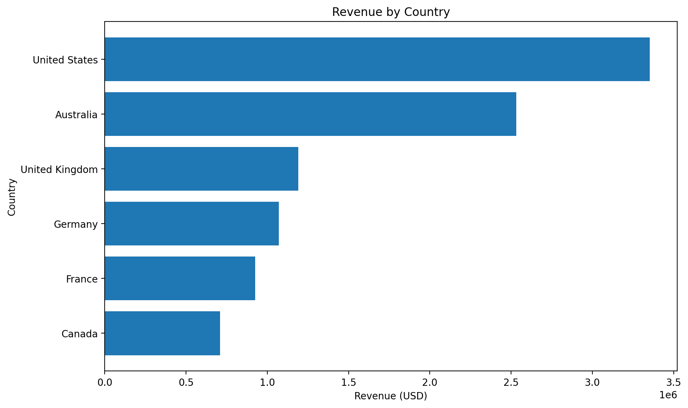
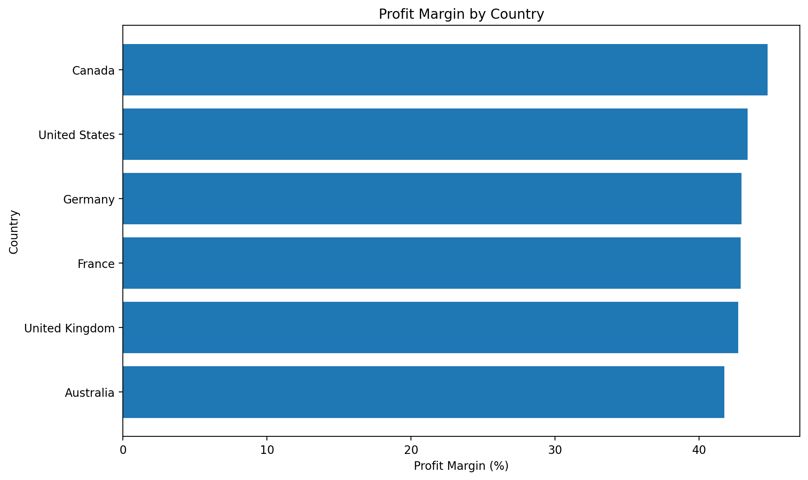
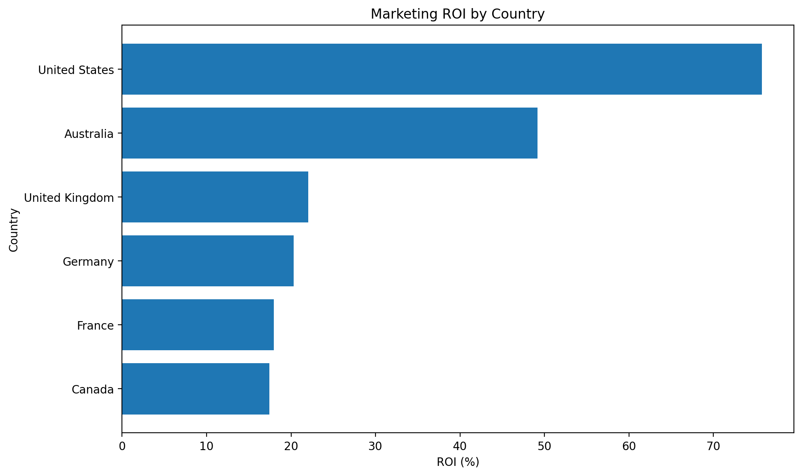
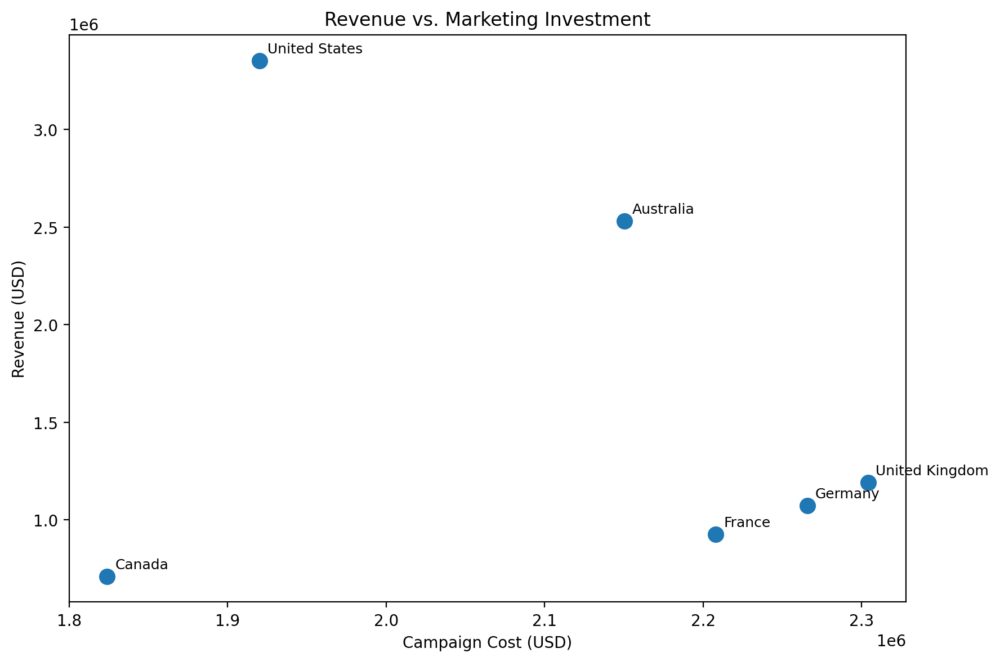

# 💰 Financial Performance Analysis

## 📊 Project Overview

This project analyzes financial performance across multiple markets using revenue, costs, gross profit, profit margin, and marketing ROI.

The objective is to evaluate how efficiently each market generates financial returns relative to its costs and marketing investment, identify performance differences across countries, and provide data-driven recommendations to support financial decision-making.

---

## 🎯 Business Objective

The analysis focuses on answering the following business questions:

- Which markets generate the highest revenue?
- Which countries achieve the strongest profit margins?
- Where is marketing investment generating the highest ROI?
- How does revenue compare with marketing investment across markets?
- Which markets represent the strongest opportunities for future investment?

---

## 🗂️ Dataset

The analysis is based on a financial performance dataset containing information for six markets:

- United States
- Australia
- United Kingdom
- Germany
- France
- Canada

### Key Metrics

| Metric | Description |
|---|---|
| Revenue | Total revenue generated by each market |
| Costs | Operating costs associated with each market |
| Campaign Cost | Marketing investment |
| Gross Profit | Revenue remaining after costs |
| Profit Margin | Gross profit relative to revenue |
| ROI | Return generated from marketing investment |

---

## 🛠️ Tools & Technologies

- SQL
- Excel
- Data Analysis
- Business Intelligence
- Data Visualization
- Financial Analysis
- KPI Analysis

---

## 🔎 Analysis Performed

The project evaluates financial performance across markets through several key areas:

### Revenue Analysis

Compared revenue generation across countries to identify the markets contributing the largest share of overall business performance.



### Profit Margin Analysis

Analyzed profit margins to evaluate how efficiently each market converts revenue into gross profit.



### Marketing ROI Analysis

Compared marketing ROI across countries to identify where marketing investment generates the strongest returns.



### Revenue vs. Marketing Investment

Examined the relationship between revenue generation and campaign investment across markets.



---

## 📈 Key Findings

### 🇺🇸 United States

The United States is the strongest-performing market in the dataset.

- Revenue: **$3.35M**
- Gross Profit: **$1.45M**
- ROI: **75.75%**

The market combines the highest revenue with the strongest marketing ROI, making it a key contributor to overall financial performance.

### 🇦🇺 Australia

Australia is the second-highest revenue market.

- Revenue: **$2.53M**
- Gross Profit: **$1.06M**
- ROI: **49.16%**

Its strong revenue generation and relatively high ROI indicate efficient market performance.

### 🇬🇧 United Kingdom

The United Kingdom generates approximately **$1.19M** in revenue and records a **22.05% ROI**.

Among the European markets analyzed, it demonstrates the strongest ROI.

### 🇩🇪 Germany

Germany generates approximately **$1.07M** in revenue with a **20.31% ROI**, showing moderate financial efficiency compared with the strongest-performing markets.

### 🇫🇷 France

France generates approximately **$924K** in revenue and records a **17.96% ROI**, indicating lower marketing efficiency compared with the United Kingdom and Germany.

### 🇨🇦 Canada

Canada generates approximately **$710K** in revenue and records a **17.43% ROI**, representing the lowest ROI among the six markets analyzed.

---

## 💡 Business Recommendations

Based on the financial performance analysis:

1. **Prioritize high-performing markets** such as the United States and Australia where revenue generation and marketing efficiency are strongest.

2. **Evaluate marketing efficiency in lower-ROI markets** to determine whether campaign budgets should be optimized or reallocated.

3. **Investigate differences in market performance** to understand why similar marketing investments produce different revenue outcomes.

4. **Use revenue, profit margin, and ROI together** when evaluating market performance rather than relying on a single KPI.

5. **Monitor marketing investment continuously** to identify opportunities to improve return on advertising spend.

---

## 📌 Business Impact

This analysis provides a structured view of financial performance across markets and helps identify:

- High-performing markets
- Revenue and profitability differences
- Marketing efficiency gaps
- Opportunities for budget optimization
- Areas requiring further investigation

The results can support more informed decisions regarding **market prioritization, marketing investment, and financial performance management**.

---

## 📂 Project Structure

```text
03-financial-performance-analysis/
│
├── README.md
│
├── Financial_Performance_Analysis.xlsx
│
└── visuals/
    ├── 01_revenue_by_country.png
    ├── 02_profit_margin_by_country.png
    ├── 03_roi_by_country.png
    └── 04_revenue_vs_marketing_investment.png
